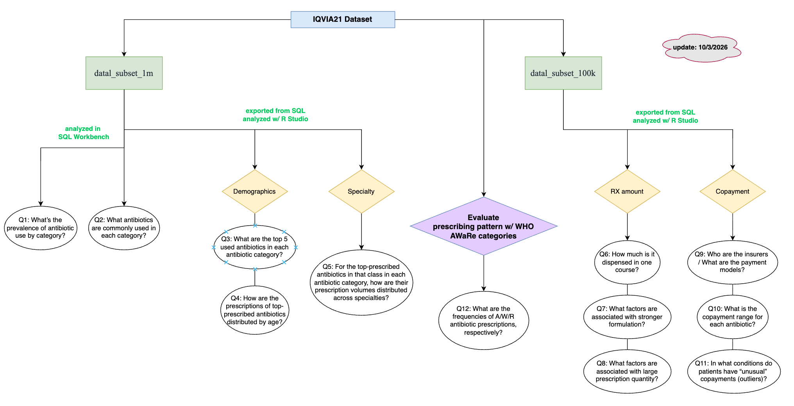

IQVIA 2021 Data Analysis

Lab notebook: [Google doc](https://docs.google.com/document/d/19mV0Xfd7w4RDHHfD-RRx0Odo8ek_zw5YJ3DSZ6eWxnc/edit?usp=sharing)

Purpose: - Have a better understanding of antibiotic use in the U.S. with real-world data - Look for potential antibiotic overuse, which is associated with antibiotic resistance - Have an insight into the financial burden of antibiotics, which is indirectly associated with antibiotic resistance

Data source: iqvia21 - provided by Rob

Analytic tool: SQL Workbench (raw data) + R (visualization & stats)

Data coverage: (Should) Span multiple outpatient healthcare settings

